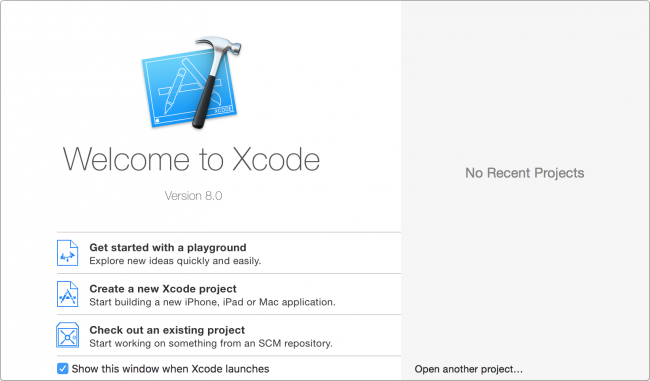
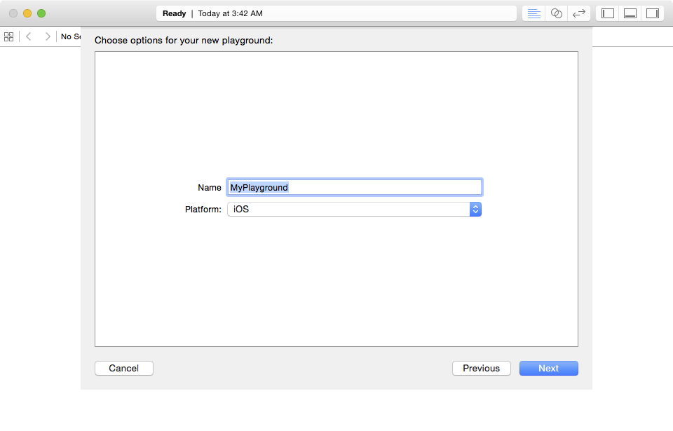
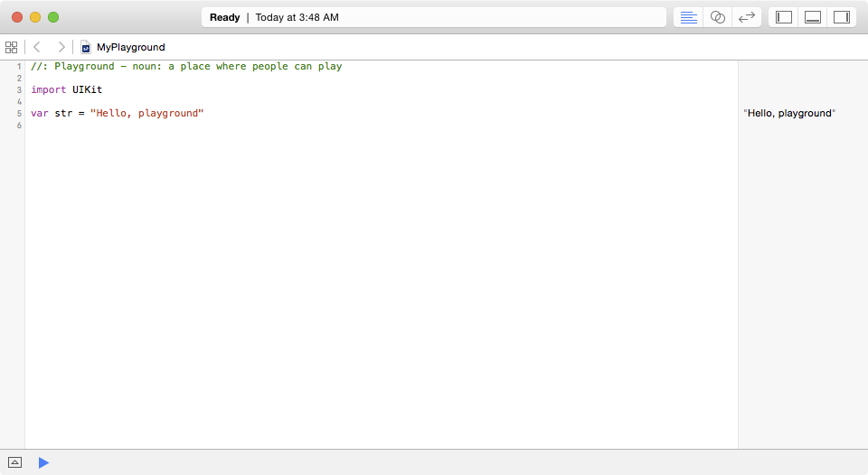

Introduction
============

About Me
--------

-   Dr Daniel Goldsmith
-   Lecturer in Ethical Hacking and Cyber Security.
-   Linux User!

About Me 2
----------

-   Background is Pervasive Computing
    -   Security of Wireless Sensor Networks
    -   Reverse engineering
    -   Radio\'s

Lectures:
---------

-   I Don\'t Like Lectures!
    -   Standing up and talking for hours is boring :(
    -   Also Programming is Practical.
-   So we have a mix of practical and Talking

Swift Language
==============

The Swift Language
------------------

-   Developed in 2010 by Chris Lattner
-   Improves Objective-C
-   Swift 3.0 in 2016

More About Swift
----------------

Swift is a new programming language for iOS, macOS, watchOS, and tvOS
apps that builds on the best of C and Objective-C, without the
constraints of C compatibility.

Swift and X-Code
----------------

-   Two Independent things:
    -   X-Code is the IDE
    -   Swift is the Language.

Lets Get Started:
-----------------

-   Start X-Code
-   Create a new Playground



Playground Options
------------------



Initial Code
------------



Writing Code Documentation
==========================

Comments
--------

-   Comments are super important
    -   Let others understand your code
    -   Let YOU understand your code
-   Follows the \"Principle of Minimal Surprise\"

Comments in Swift
-----------------

-   Single Line Comment

``` cs
// This is a comment
```

-   They can also stack

``` cs
// First Line of Comment
// Second Line of comment
```

Multiline Comments
------------------

-   But a better way is:

``` cs
/* This is also a comment.
   Over many..
   many...
   many lines. */
```

Documenting Code
----------------

-   You do not need to comment every line
    -   Some stuff should be self-explanatory
-   Try to capture the Logic
    -   WHY did you do something
    -   WHAT does a particular class / function do.

Documenting Code: Example
-------------------------

\footnotesize
``` cs
// we create a new Todo object
var newList = Todo()
// we now call the addItem method to add two strings to the list
newList.addItem("Cheese")
newList.addItem("Milk")
```

Documenting Code: Functions
---------------------------

\scriptsize
``` cs
/// adds a new item to the list
/// - parameters:
///   - Int: The index of the list item to be returned.
/// - throws: A `TodoError.indexOutOfRange` error, if the index is invalid.
/// - returns: A string containing the list item.
func getItem(atIndex index:Int) throws -> String {
    ...
}
```

Getting Started
===============

Hello World!
------------

-   The Traditional first program
-   Type in the following, and click the run button.

``` cs
//print Hello to the screen
print("Hello, world!")
```

Some things to note:
--------------------

-   Depending on languages you are familiar with (C,Java,C++):
    -   No need to import libraries
    -   No Semicolons at the end of each line

Core Variables
==============

Constants and Variables:
------------------------

-   Constants: Defined Once, cannot change
  - Defined with **let**
-   Variables: Can have different values
  - Defined with **var**
  
Constants and Variables:
------------------------

``` cs
//A Constant
let pi=3.14

//A Variable
var radius=5.0

//And another 
var circumference = 2 * pi * radius
```

Constants and Variables: 2
--------------------------

-   Lets Change some values

``` cs
//Constant
let pi=3.14

//Variable
var radius=5.0

//Change the Variable
radius = 2.0
```

Constants and Variables: 3
--------------------------

-   Lets break something

``` cs
//Constant
let pi=3.14

//Variable
var radius=5.0

//Error when we try to change the constant
pi = 3.1
```

What about Types?
-----------------

-   If we define an initial value swift is clever enough to work out the
    type.
-   However, some times we need to define it ourselves

General Types
--------------

``` cs
// Round numbers
var number: Int = 10
// Decimal Numbers
var decimal: Double = 3.14

// Text
var text: String = "Hello World"

//Boolean
var status = true
```

More Types
----------

``` cs

//Multiple definions
var decimalOne, decimalTwo: Double

decimalOne = 5.0
decimalTwo = 22.5
```

Gotchas: Integers
-----------------

-   Integer Only Arithmetic. Drops decimal numbers:
    -   What Happens, How do we fix it

``` cs
var number = 22
var value = 7
//This is 3
var output = number / value
```

Gotchas: Type Safety
--------------------

-   Values types are Locked once defined
    -   Swift will not allow you to pass a float to a string etc.
-   What happens here, How do we fix it?

``` cs
//Define a string
var text: String
//Try to set a value
text = 3.14
```

Gotchas: Conversion
-------------------

-   By default no conversion is performed
    -   Means we have difficulties combining items and need to **cast**
        it to the correct type
    -   Try the following with and without the conversion.

``` cs
//Define our number
var number = 42
//And build a string from it
var text = "The meaning of Life is " + String(number)
```

Converting Strings (2)
----------------------

-   These is an even easier way to convert strings
    -   Use **\\(...)**

``` cs
//Define Number
var number = 42
//Build String
var text = "The Meaning of Life is \(number)"
```

Arithmatic
----------

-   Normal Maths applies

``` cs
//Add Numbers
var number = 4+4
//Subtract 
var number = 4-2
//Divide
var number = 4/2
//Multiply 
var number = 4*2
```

Running Totals
--------------

-   We can also add to existing numbers

``` cs
//Define
var number = 4
//Add 5 to the number
number = number + 5
//Or Shorter version
number += 5
```

Printing Things
---------------

-   Sometimes we want output

``` cs
//Define Number
var number = 42
//Build String
var text = "The Meaning of Life is \(number)"
//Print to screen
print(text)
```

Printing Things (one liner)
---------------------------

-   We can also do this without the intermediate Variable

``` cs
//Define number
var number = 42

//Print
print ("The meaning of life is \(number)")
```

Your Turn:
----------

-   Type the basic program below

\scriptsize
``` cs
//Constant
let pi = 3.14
//Variable
var radius = 5

//Calculations
var circumference = 2 * pi * radius

//Output 
print("Cirumference of Circle with Radius \(radius) is \(circumference)")
```

Your Turn:
----------

-   You have ~20 Minutes to Modify the code to:
    -   Store your name as a variable
    -   Print the area of the Circle (Pi \* R^2^)
    -   Print \"Hello \<your name\>\"
	-   Print Circumferenace and Area of a circle with radius 10

Lists and Dictionaries
======================

Collections of Variables
------------------------

-   So far we have looked at primitive variables
-   Lists and Dictionaries allow us to deal with groups of objects

Lists
-----

-   Allow us to store collections of items
-   We use Square Brackets **\[\]**

``` cs
//Define a list
var shoppingList = ["Orange", "Water", "USB Drive"]

//Or an Empty List
var emptyList = [String]()
```

Getting data from lists
-----------------------

-   We use the List Index
    -   Starts at 0 (it does make sense in terms of Memory Management)

``` cs
//Define a list
var shoppingList = ["Orange", "Water", "USB Drive"]

//Print the 1st (0th) Item
print(shoppingList[0])

//Change the 2nd value ("water")
shoppingList[1] = "Bottle of Water"
```

How many Items
--------------

- We can use **count**

\footnotesize
``` cs
//Define a list
var shoppingList = ["Orange", "Water", "USB Drive"]

//This should print 3
print ("The Size of the shopping list is \(shoppingList.count)")
```

Adding Items
------------

``` cs
//Define a list
var shoppingList = ["Orange", "Water", "USB Drive"]

//Add an Item
shoppingList.append("Book")

//What happens if we want to add it at a specific place
shoppingList.insert("Beer", at: 0)
```

Removing Items
--------------

``` cs
//Define a list
var shoppingList = ["Orange", "Water", "USB Drive"]

//Remove the First item
shoppingList.remove(at: 0)
```

Printing all items in an List
-----------------------------

-   We can also Iterate over the array

``` cs
//Define a list
var shoppingList = ["Orange", "Water", "USB Drive"]

for item in shoppingList {
    print(item)
}
```

Dictionaries
------------

- Allow us to store items as \"Key\":\"Value\" pairs
    - We then access the item using the Key
- Useful for storing named values.

Dictionaries
-------------

\footnotesize
``` cs
//Define a dictonary
var occupations = ["Dan" : "Lecturer", "James": "Senior Lecturer"]

//And print some values (Will print "Lecturer")
print(occupation["Dan"])

//Give James a Promotion
occupation["James"] = "Professor"
```

Adding Items to dictionaries
----------------------------

-   NOTE: The change to the layout

``` cs
//Define a dictonary
var occupations = ["Dan" : "Lecturer",
                   "James": "Senior Lecturer",
                  ]
//Add a new person
occupations["Mark"] = "Teaching Assistant"
```

Iterating over dictionaries
---------------------------

- Returns a tuple by default

``` cs
//Define a dictonary
var occupations = ["Dan" : "Lecturer",
                   "James": "Senior Lecturer",
                  ]

//Either have items returned as a tuple
for value in occupations {
    print("Tuple is \(value)")
}
```

Iterating over dictionaries
----------------------------

Get each key:value pair.

``` cs
//Or decompose the tuple
for (name, job) in occupations {
    print("\(name): works as a \(job)")
}
```

Your Turn: Reference Code
--------------------------

``` cs
//Create an empty List
var shoppingList = ["Orange", "Water", "USB-Drive"]
//How many items in the list
print ("List Has \(shoppingList.count) items")
/Add an Item 
shoppingList.append("Apple")
//And print it out
for item in shoppingList{
    print ("Item in list \(item)")
}
```


Your turn: Tasks
------------------

- Task 1:
  -   Create a new list of numbers **Grades** and populate it with some
    scores
  -   Add a new grade to the list
  -   Iterate through the list and print all the grades
    -   BONUS: Using another variable, try to calculate the average
        grade
- Task 2:
  - Convert the list into a dictionary of "Class": Grade pairs
    - Print the grade for each Class


Solution
--------

Hopefully you have something like this:
  - Do Dictonaries together.

\scriptsize
``` cs
//Create a grades object
var grades = [70,65,72,50]

//Add a new grade
grades.append(70)

//Something to hold our total (Note its a floating point)
var total = 0

for item in grades{
    total += item
}

print("Average grade is \(Double(total) / Double(grades.count))")
```

Selection and Iteration
=======================

Selection and Iteration
-----------------------

-   So far we have introduced variables, and some more complex data
    structures
-   To write useful programs we need to do something with them
    -   Selection: Choosing what to do based on an input
    -   Iteration: Doing something many times

Conditions
----------

-   We have several conditions we can evaluate against
    -   **==** Equal To
    -   **!=** Not Equal To
    -   **\>** Greater Than
    -   **\<** Less Than
    -   **\>=** Greater or Equal to
    -   **\<=** Less or Equal to

Conditions
----------

``` cs

5 == 5  //True 
4 == 5  //False
10 > 5  //True
10 < 5  //False
5 >= 5  //True

```

Selection
---------

-   **If** condition is met, then do something

``` cs
var value = 10

if value > 5 {
    print("Value is Greater than 5")
}
```

Selection: Providing an alternative
-----------------------------------

-   We can use **Else**

``` cs
var value = 10

if value > 5 {
     print("Value is Greater than 5")
}
else {  //Otherwise
     print("Value is less than 5")
}
```

Selection, Multiple Choice
--------------------------

-   Note Order is important here

``` cs
value = 10
if value == 5 {
    print("Value is equal to 5")
}
else if value > 5 {
    print("Value is greater than 5")
}
else {
    print("Value is less than 5")
}
```

Selection Task
--------------

-   Lets write a (broken) grade calculator
    -   Try running with different values for grade, what happens?
    -   Can you fix the code to work correctly

Selection Task
---------------

\small
``` cs
var grade = 55

//Fail
if grade < 40 {
     print ("Sorry, you failed")
} else if grade > 70 {
     print ("Congratulations you got a 1st")
} else if grade >= 40{
     print ("That sucks, a 3rd")
} else if grade >= 50 {
     print ("OK, a 2:2")
} else if grade >= 60 {
     print ("Not bad, a 2:1")
} else { //Catch things outside of expected range
     print ("Grade outside of boundries")
}
```

More Selection
--------------

-   We can also use **Switch** statements to achieve the same aim
    -   Again, try the code. Does it need fixing.

\scriptsize
``` cs
var grade = 55

switch grade{
    case 0..<40:
        print ("Sorry, you failed")
    case 70..100:
        print ("Congratulations, a 1st")
    case 60..<70:
        print ("Not bad, a 2:1")
    case 40..<50:
        print ("That Sucks, a 3rd")
    case 50..<60:
        print ("OK, a 2:2")
    default:  //Catch all
        print ("Grade outside of boundries")
}  
```

Iteration:
----------

-   Allows us to do things many times.
    -   Go through the items in a list
    -   repeat a task a given number of times
    -   repeat a task until a condition is met

For and While Loops:
--------------------

-   **FOR** when we know how many items there are
    -   Items in a list
    -   Do things a set number of times
-   **WHILE** stop when a condition is met
    -   While we are still getting user input
    -   To keep doing something until told to stop.

For Loops (1)
-------------

-   We have already met some for loops (called for-in loops):
    -   Iterate through items in the list

``` cs
//Define List
var thelist = ["foo","bar","baz"]
//For - In loop
for item in thelist {
     print(item)
}
```

For Loops (2)
-------------

-   We can also define a **range** of numbers to use

``` cs
//A Range between 0 and 5
for index in 0..<5 {
    print ("Index is \(index)")
}
```

For Loops (3)
-------------

-   We can use the index to access items in a list
    -   This is the longhand version of the for-in loop

``` cs
//Define List
var thelist = ["foo","bar","baz"]

//Indexed For loop

for index in 0..<thelist.count {
    print ("Item at Index \(index) is \(thelist[index])")
}
```

While Loops:
------------

-   Sometimes we dont know the number of items we need to deal with
-   In this case we use a **WHILE** loop
    -   **WHIlE** something is true, continue looping
-   It is **REALLY IMPORTANT** to remember to change the condition
    otherwise you can get infinite loops.

While Loops (2):
----------------

-   So Lets keep doubling a number

``` cs
//Initialise Variable
var total=1
while total < 25 {
   print("Total is \(total)")
   //And add it to iteslf
   total += total
}
```

While Loops (3):
----------------

-   Using a **While** as a **For**
    -   Question: Why not \<= ?

``` cs
//Define List
var thelist = ["foo","bar","baz"]

//and an index 
var index = 0

while index < thelist.count {
    print("Item at index \(index) is \(thelist[index])")
    index += 1
}
```

Your Turn
---------

-   Remember the List of Grades?
-   Remember the Classification Calculator
-   Combine the two:
    -   Print the score for each grade
    -   Print the final grade classification

Functions / Methods
===================

Functions and Methods:
----------------------

-   So far we have been writing all the code in the global namespace
    -   This is a BadThing(TM) as it reduces modularity
    -   We have to keep copying chunks of code
    -   Leads to the potential for lots of mistakes.

Functions
---------

-   Allow us to break the code into \"Logical\" blocks
-   We can then call the function from the code, to make use of it.

-   For example, good candidates for functions are:
    -   The **calculate grade** code we used before.
    -   The Math we did to calculate parts of a circle.

Defining Functions
------------------

-   We use the **func** syntax.
  - **name** of function
  - **parameters** (optional) that the function accepts
  - **return** (optional) value type

``` cs
func <name>(<parameters>) -> <return> {
  ...
}
```


Defining the grade function
---------------------------

-   We know that the grade function:
    -   Takes a value as input
    -   Prints the grade message

Defining the grade function (1)
-------------------------------

-   The first cut of the grade function looks like this.
\small
``` cs
func grade(mark: Double) {
    if mark < 40 {
        print ("Sorry, you failed")
    } else if mark > 70 {
        print ("Congratulations you got a 1st") 
    } else if mark >= 60 {
        print ("Not bad, a 2:1")
    } else if mark >= 50 {
        print ("OK, a 2:2")
    }else if mark >= 40{
        print ("That sucks, a 3rd")
    } else { //Catch things outside of expected range
        print ("Mark outside of boundries")
}
```

Calling the grade function
--------------------------

-   We can then call the function, including any parameters


``` cs
var score = 55

grade(mark: score)
```

Improving the Grade function
----------------------------

-   But there are some issues here:
    -   Except for debugging Functions shouldnt really print things
    -   It is more appropriate to have the function return a value (as
        it can be used anywhere)

Improving the Grade function
----------------------------

``` cs
func grade(mark: Double) -> String {
    if mark < 40 {
        return "Sorry, you failed"
    } else if mark > 70 {
        return "Congratulations you got a 1st") 
    } else if mark >= 60 {
       return "Not bad, a 2:1"
    } else if mark >= 50 {
        return "OK, a 2:2"
    }else if mark >= 40{
        return "That sucks, a 3rd"
    } else { //Catch things outside of expected range
        return "Mark outside of boundries"
}
```

Calling the improved grade function
-----------------------------------

``` cs
score = 55

var result = grade(mark: score)
print (result)
```

Documenting the Grade Function
------------------------------

-   We should also document our grade function

\footnotesize
``` cs
func grade(mark:Double) -> String{
    /* Convert a students grade into textual feedback
       - parameters:
           - mark:  Double representing the students numerical mark
       - returns: A String representing text based feedback
    */
    if mark < 40
        ...
}
```

Dealing with multiple parameters
--------------------------------

-   We can specify multiple parameters to a function

``` cs
func area(pi: Double, radius: Double) -> Double {
    /* Calculate the Area of a circle
       - parameters: 
         - pi:  Value of Pi
         - radius: Radius of cicle
       - return:  The circles area
       */
```

Functions: Your Turn
--------------------

``` cs
//Value for Pi
let pi = 3.14

//A List of Circles
var circles = [1.0, 2.0, 5.0, 10.0]

func area(pi: Double, radius: Double) -> Double {
    /* Calculate the Area of a circle
       - parameters: 
         - pi:  Value of Pi
         - radius: Radius of cicle
       - return:  The circles area
       */
    return pi * (radius * radius)
}
```

Functions:  Your turn 
----------------------
- Create a function to calculate and return the Circumference (2*pi*r)

- Get the program to calculate and print the Area and Radius for each of the circles


Classes
=======

Classes
-------

-   So Far our code has had no Class :)
-   Classes are a way of abstracting behaviour and are core to OO
    programming.
-   Classes represent a \"thing\" in our program
    -   People
    -   Shapes
    -   Courses

Defining Classes
----------------

-   We can use the **class** keyword

``` cs

class Person { 
  ...
}
```

Creating Objects
----------------

-   Instances of each class are known as Objects
-   We can create them by putting parenthesis after the name

``` cs
var Dan = Person()
```

Class Variables
---------------

-   Class\'s also have attributes,
-   These are the variables that make the class unique
-   For example a person could have:
    -   First (Given) Name
    -   Last (Family) Name
    -   Age

Adding Class Variables
----------------------

``` cs
class Person{
    /* Defines a Person */
    var givenName: String 
    var familyName: String
    var age: Int
} 
```

Accessing Class Variables
-------------------------

-   Use Dotted Syntax

\footnotesize
``` cs
class Person{
    /* Defines a Person */
    var givenName: String 
    var familyName: String
    var age: Int
} 

//Create a person object
var Dan = Person()
//Set variables
Dan.givenName = "Daniel"
Dan.familyName = "Goldsmith"

//Print my Name
print("Full Name is \(Dan.givenName) \(Dan.familyName)")
```

Constructors
------------

-   Using Dotted syntax is clumsy when creating objects
-   Instead we use Constructors
    -   The special **init** method.
    -   Takes parameters and is used to set variables

Constructors
------------
\footnotesize
``` cs
class Person{
    /* Defines a Person */
    var givenName: String 
    var familyName: String
    var age: Int

    init(givenName: String, familyName: String){
        //Create a new Person with provided names
        //Note the use of Self to differentiate between class and parameters
        self.givenName = givenName
        self.familyName = familyName
    } 

var Dan = Person("Daniel","Goldsmith")
```

Constructors without the self
-----------------------------

``` cs
class Person{
    /* Defines a Person */
    var givenName: String 
    var familyName: String
    var age: Int

    init(given: String, family: String){
        //Create a new Person with provided names
        //Note the parameters are less readable
        givenName = given
        familyName = family
    } 

var Dan = Person("Daniel","Goldsmith")
```

Class Functions
---------------

-   Each class will have a set of functions associate with it
-   These can access the class variables to perform tasks
-   Defined in a similar way to normal functions
  - BUT within the scope of the class.
  
Class Functions
---------------

\footnotesize
``` cs
class Person{
    /* Defines a Person */
    var givenName: String 
    var familyName: String
    var age: Int

    init(given: String, family: String){
        //Create a new Person with provided names
        //Note the parameters are less readable
    givenName = given
    familyName = family
    } 

    func getName() -> String {
        //No parameters,  Return full name as string
        return "\(givenName) \(familyName)"
    }
```

Calling Functions
-----------------

-   Call the function by using \<object\>.\<function\>

``` cs

var Dan = Person("Daniel", "Goldsmith")

var theString = Dan.getName()
print(theString)
```

Your Turn
---------

-   Its time to make some Shapes
    -   Create Classes for three different shapes (ie Square, Rectangle,
        Triangle)
    -   Each Shape should have functions that return its Area, and
        Circumference.
    -   Test the Shape functions out. Make sure they work.
